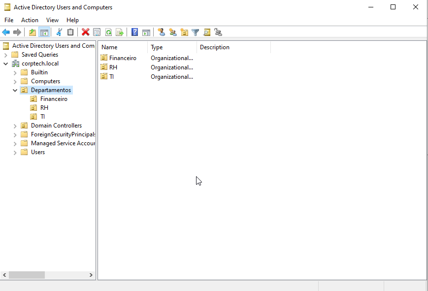
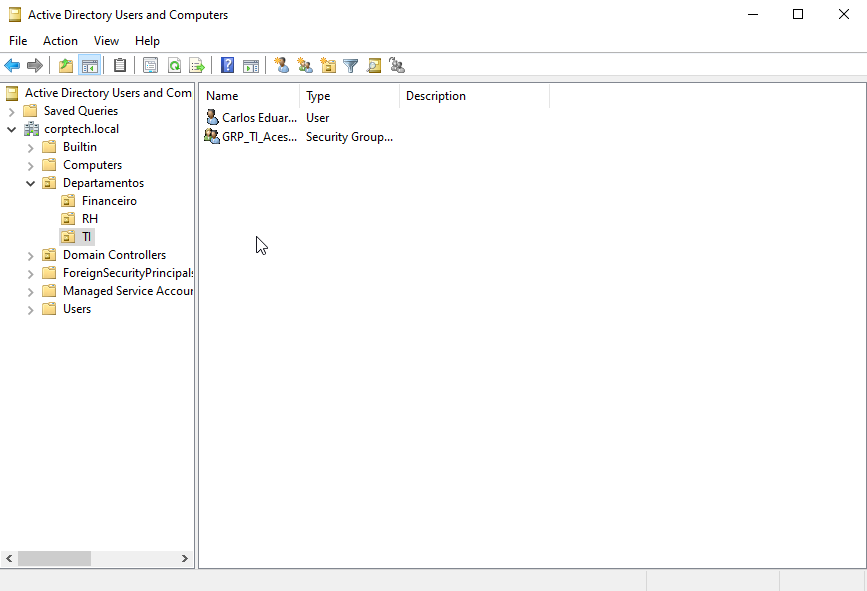
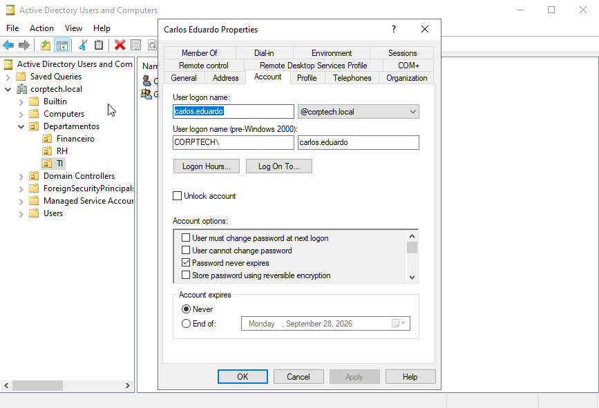
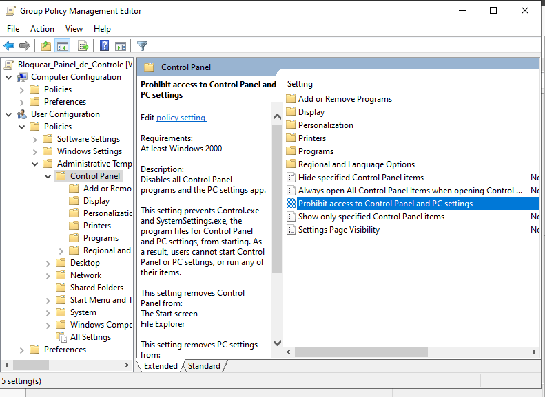

# Active Directory — Laboratório Prático

Documentação do laboratório de Active Directory montado com VirtualBox e Windows Server 2022 — simulando um ambiente corporativo real para desenvolvimento de habilidades técnicas em administração de identidades e acessos.

---

## Ambiente do Laboratório

| Item | Configuração |
|------|-------------|
| Virtualização | VirtualBox |
| Sistema Operacional | Windows Server 2022 Standard Evaluation |
| Domínio | corptech.local |
| Controlador de Domínio | WIN-2C7I5KSUOVG |
| RAM alocada | 4096 MB |
| Processadores | 2 |
| Disco | 50 GB |

---

## Estrutura do Domínio

- corptech.local
  - Departamentos
    - TI — Carlos Eduardo (usuário) — GRP_TI_Acesso (grupo de segurança)
    - Financeiro — Ana Lima (usuário) — GRP_Financeiro_Acesso (grupo de segurança)
    - RH — Paula Santos (usuário) — GRP_RH_Acesso (grupo de segurança)

---

## O que foi praticado

- Instalação e configuração do Active Directory Domain Services
- Promoção do servidor a Controlador de Domínio
- Criação de Unidades Organizacionais — OUs
- Criação de usuários e grupos de segurança
- Adição de usuários a grupos
- Desbloqueio de contas
- Redefinição de senhas
- Criação e configuração de GPO
- Configuração da política de senha do domínio via Default Domain Policy
- Configuração de bloqueio automático de conta por tentativas inválidas
- Validação de políticas por linha de comando com gpupdate e net accounts

---

## Documentação

| Documento | Descrição |
|-----------|-----------|
| [Configuração do Lab](lab-setup.md) | Instalação e configuração do ambiente |
| [Usuários e Grupos](usuarios-e-grupos.md) | Criação e gerenciamento de usuários |
| [GPO — Painel de Controle](gpo-painel-controle.md) | Política de bloqueio do Painel de Controle |

---

## Evidências do Laboratório

### Print 1 — Estrutura de OUs

### Print 2 — OU TI com usuário e grupo

### Print 3 — Propriedades do usuário Carlos Eduardo

### Print 4 — GPO configurada no Group Policy Management Editor

---

| [Política de Senha e Bloqueio](politica-senha-bloqueio.md) | Configuração e teste da política de senha e lockout |

---

**Analista:** Matheus Grun  
**Última atualização:** Agosto 2026
